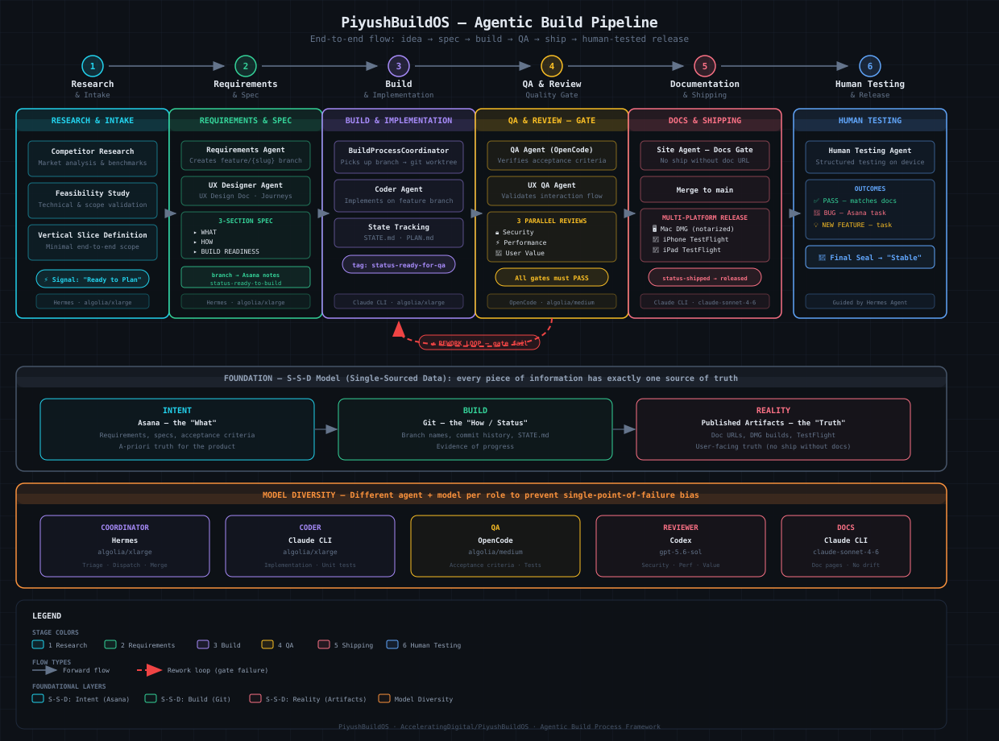

# PiyushBuildOS — Agentic Build Process Framework

> A general-purpose framework for orchestrating AI agents through a gated, multi-role software development pipeline — from research to shipped release.

PiyushBuildOS defines a structured process where specialized AI agents (each with distinct roles, models, and tools) collaborate to build software autonomously, with human oversight at critical gates. It was derived from the [hOS project](https://github.com/AcceleratingDigital/hos) and designed to be reusable for new projects.

---

## How It Works

The framework is built on three foundational ideas:

### 1. The S-S-D Model (Single-Sourced Data)

Every piece of information has **exactly one source of truth** to prevent drift and hallucination:

| Surface | Source of Truth | What Lives Here |
|---|---|---|
| **Intent** (The "What") | Project Management tool (e.g., Asana) | Task definitions, specs, decisions, status tags |
| **Build** (The "How/Status") | Git (origin/main) | Code, branches, PRs, release tags |
| **Reality** (The "Truth") | Published artifacts (DMGs, TestFlight, marketing site) | What users actually install and experience |

If a task is marked "released" in Asana but the artifact doesn't contain it, that's a critical inconsistency. The S-S-D model makes these mismatches detectable.

### 2. The Agentic Pipeline (6-Stage Gated Flow)

Features move through a strict pipeline where each stage has a defined trigger signal, owner, and exit gate:

```
Research & Intake → Requirements & Spec → Build & Implementation
→ QA & Review → Documentation & Shipping → Human Testing & Release
```

| Stage | What Happens | Trigger Signal | Exit Gate |
|---|---|---|---|
| **1. Research & Intake** | Competitor analysis, feasibility study, vertical slice definition | Task created in PM tool | Moved to "Ready to Plan" |
| **2. Requirements & Spec** | Requirements agent creates `feature/{slug}` branch, writes 3-section spec (WHAT/HOW/BUILD READINESS), UX designer produces design doc | "Ready to Plan" section move | Tagged `status-ready-to-build` + branch name in PM notes |
| **3. Build & Implementation** | Coordinator creates git worktree, dispatches coder agent to implement on the feature branch | `status-ready-to-build` tag | Tagged `status-ready-for-qa` |
| **4. QA & Review** | QA agent verifies acceptance criteria, UX QA validates flow, 3 parallel reviewers (security/performance/user-value) audit | `status-ready-for-qa` tag | All gates pass → `status-qa-passed` |
| **5. Documentation & Shipping** | Site agent generates doc page (no ship without URL), coordinator merges to main, multi-platform release | `status-qa-passed` tag | Merged + released → `status-shipped` → `status-released` |
| **6. Human Testing** | Product owner tests on real device with structured guidance. Outcomes: PASS / BUG / NEW FEATURE | Release published | Manual sign-off → "Stable" |

**Rework loop:** If any QA or review gate fails, feedback is written to the task → coder agent fixes → QA/review re-runs. If a feature requires >3 rework loops, it's flagged for a design audit.

### 3. Model Diversity (Checks & Balances)

Different agents use **different tools and models** to prevent single-point-of-failure in reasoning. The agent that writes code is not the one that verifies it, and the tool verifying it isn't the same one that reviewed it.

| Agent Role | Tool/CLI | Primary Model | Why This Tool |
|---|---|---|---|
| **Coordinator** | Hermes Agent | `algolia/xlarge` | Orchestration, triage, merging |
| **Coder** | `claude` CLI | `algolia/xlarge` | Code generation |
| **QA** | `opencode` CLI | `algolia/medium` | Spec verification, test execution |
| **Reviewer (Security)** | `codex` CLI | `gpt-5.6-sol` | Deep security audit (model diversity) |
| **Reviewer (Perf/UX)** | `codex` CLI | `algolia/xlarge` | Architecture & user-value audit |
| **Docs / Site** | `claude` CLI | `claude-sonnet-4-6` | Superior HTML/CSS and documentation |
| **Requirements** | Hermes Agent | `algolia/xlarge` | Spec writing, branch management |

All models route through a LiteLLM proxy, enabling transparent fallback if a primary model is unavailable. Feature specs **never name a model** — model selection is a runtime decision by the Model Router.

---

## Pipeline Diagram



---

## Agent Roles

Each role has a strict boundary — what it does and what it must never do:

| Role | Does | Must Never Do |
|---|---|---|
| **BuildProcessCoordinator** | Triage, dispatch, merge, release | Write source code |
| **Requirements Agent** | Research, spec writing, create feature branches | Implement code |
| **UX Designer** | User journeys, layouts, micro-copy | Write implementation logic |
| **Coder** | Implement features, write unit tests | Touch shared files outside assigned branch |
| **QA** | Verify acceptance criteria, run tests | Edit code (reports PASS/FAIL only) |
| **UX QA** | Validate interaction flow and "feel" | Report bugs (focuses on usability, not functionality) |
| **Reviewer** | Audit security, performance, user value | Fix code (reports findings only) |
| **Site Agent** | Generate user-facing docs and marketing pages | Let docs drift from actual code |
| **Human Testing** | Guide product owner through structured release testing | Fix bugs in-session (logs them as tasks) |

---

## Repo Layout (4-Checkout Isolation)

To prevent "context pollution" and accidental edits, different agents work in isolated checkouts:

| Checkout | Branch | Who Works Here |
|---|---|---|
| **Monorepo** | `main` | BuildProcessCoordinator only (builds in worktrees, merges, releases) |
| **Requirements** | `requirements` | Requirements agent + product owner (specs, scope docs) |
| **Dev** | `dev` | Interactive sessions (rapid prototyping, one-off fixes) |
| **Site** | `main` (separate repo) | Site agent (marketing site, doc pages, downloads) |

Nobody commits directly to main except the coordinator merging feature PRs.

---

## Key Design Principles

### Delta-Only Communication
Agents never report "no changes" or "everything is fine." **Silence = healthy pipeline.** Only meaningful state changes trigger alerts: build started, shipped, failed, released.

### Asana Notes Are the Contract
If it's not in the PM tool's task notes, it didn't happen. All handoff data (specs, branch names, diagnostics, build results) is persisted in task notes — not in chat history or agent memory.

### Serialized Builds
One feature builds at a time. The coordinator never dispatches multiple coders in parallel. This is a deliberate trade-off: predictability over throughput.

### Concurrency Guardrails
- **Baton pattern:** Explicit handoff entries (who, what, what state) when passing work between agents
- **Lease-based statuses:** `status-in-progress` is a lease, not a permanent state — no heartbeat for 30 minutes = task reverts to `status-ready-to-build` + stall alert
- **Atomic PRs:** Regardless of internal iterations, a feature produces exactly one PR to main

### The Docs Gate
No feature ships without a user-facing documentation page. The site agent must generate a doc page (with a live URL) before the coordinator can merge. A feature without docs is not done.

### Multi-Platform Release
Every release ships **all platforms** — Mac DMG (notarized), iPhone (TestFlight), iPad (TestFlight). Release is not complete until all builds reach VALID state. No platform is skipped.

---

## Evolution: Gated Graph Architecture

The pipeline is designed to evolve from a linear sequence into a **"Gated Graph"** — self-correcting clusters separated by human-verified gates:

- **Macro-pipeline stays linear:** Research → Spec → Build → QA → Ship
- **Build stage becomes a micro-graph:** Coder → Verifier → Router loop with internal self-correction
- **Recursive decomposition:** Large tasks dynamically split into a DAG of smaller interdependent tasks
- **Circuit breaker:** Max 5 internal iterations before freeze + human escalation
- **S-S-D anchor:** Graph state is temporary; final truth always commits back to S-S-D surfaces

See [`architecture/EVOLUTION_TO_GRAPH.md`](architecture/EVOLUTION_TO_GRAPH.md) for the full blueprint.

---

## Repository Structure

```
PiyushBuildOS/
├── PROCESS_FRAMEWORK.md          # Core framework doc — the "what and why"
├── architecture/
│   ├── DECISION_PATTERN.md       # Decision log template and locked decisions
│   ├── EVOLUTION_TO_GRAPH.md     # Blueprint for gated-graph evolution
│   └── TECH_CONSTRAINTS.md       # Technical constraints and architecture
├── models/
│   ├── INFERENCE_INFRASTRUCTURE.md  # Self-hosted GPU inference plan
│   ├── MODEL_SELECTION_POLICY.md    # LLM tiered-intelligence policy
│   └── TOOL_MODEL_MATRIX.md         # Exact tool/model mapping per role
├── roles/
│   ├── SHARED-CONTEXT.md          # Cross-cutting context (read by ALL agents)
│   ├── build-process-coordinator.md
│   ├── coder.md
│   ├── docs-tech.md
│   ├── human-testing.md
│   ├── marketing.md
│   ├── qa.md
│   ├── requirements-agent.md
│   ├── reviewer-performance.md
│   ├── reviewer-security.md
│   ├── reviewer-user-value.md
│   ├── ux-designer.md
│   └── ux-qa.md
├── evaluation/
│   └── VERIFICATION_PROCESS.md   # How we verify the system is improving
└── docs/
    └── pipeline-diagram.svg      # Visual pipeline overview
```

---

## Getting Started

### To adopt this framework for your project:

1. **Set up your PM tool** (Asana, Linear, etc.) with status tags matching the pipeline stages:
   `status-ready-to-plan` → `status-ready-to-build` → `status-in-progress` → `status-ready-for-qa` → `status-qa-passed` → `status-docs-done` → `status-shipped` → `status-released`

2. **Create 4 git checkouts** (or branches) following the isolation model above.

3. **Copy the role files** from `roles/` and customize them for your project. Start with `SHARED-CONTEXT.md` — every agent reads it first.

4. **Configure your model routing** through a proxy (LiteLLM or similar). Assign models per the [Tool-Model Matrix](models/TOOL_MODEL_MATRIX.md).

5. **Set up your coordinator agent** (we use [Hermes Agent](https://hermes-agent.nousresearch.com)) with a cron schedule to poll for `status-ready-to-build` tasks.

6. **Configure your coder/QA/reviewer CLIs** (Claude CLI, OpenCode, Codex) to route through the proxy.

### Prerequisites

- A project management tool with tag/section support (Asana recommended)
- Git hosting with PR workflow (GitHub recommended)
- LLM proxy for model routing (LiteLLM recommended)
- AI coding CLIs: `claude`, `opencode`, `codex` (or equivalents)
- An orchestrator agent for the coordinator role (Hermes Agent recommended)

---

## Origin

This framework was extracted from the [hOS project](https://github.com/AcceleratingDigital/hos) — a family operating system built with a team of AI agents coordinated through this exact process. It has been used to ship multiple releases across Mac, iPhone, iPad, and Apple Watch platforms, with automated builds, QA, security review, documentation, and TestFlight distribution.

---

## License

This framework is shared for reference and adaptation. See the [hOS repository](https://github.com/AcceleratingDigital/hos) for the project it was derived from.

---

## Getting Started with a New Project

See **[ONBOARDING.md](ONBOARDING.md)** — the complete guide for starting fresh or taking over an existing project. Covers:
- Required inputs (Asana, GitHub, Slack, site URL, local paths)
- 4-checkout layout initialization
- Asana tag setup
- Taking over an existing repo (baseline audit, S-S-D reconciliation)

**[PROJECT_CONFIG_TEMPLATE.md](PROJECT_CONFIG_TEMPLATE.md)** — fill-in-the-blank SHARED-CONTEXT.md for a new project.

**[CRON_SETUP.md](CRON_SETUP.md)** — exact cron prompts, schedules, stagger reference, health verification.

**[models/MODEL_VERIFICATION.md](models/MODEL_VERIFICATION.md)** — pre-start model health check. Run before first build.

**[architecture/COLLISION_MODEL.md](architecture/COLLISION_MODEL.md)** — agent-agent, agent-human, and multi-user concurrency protocols.
